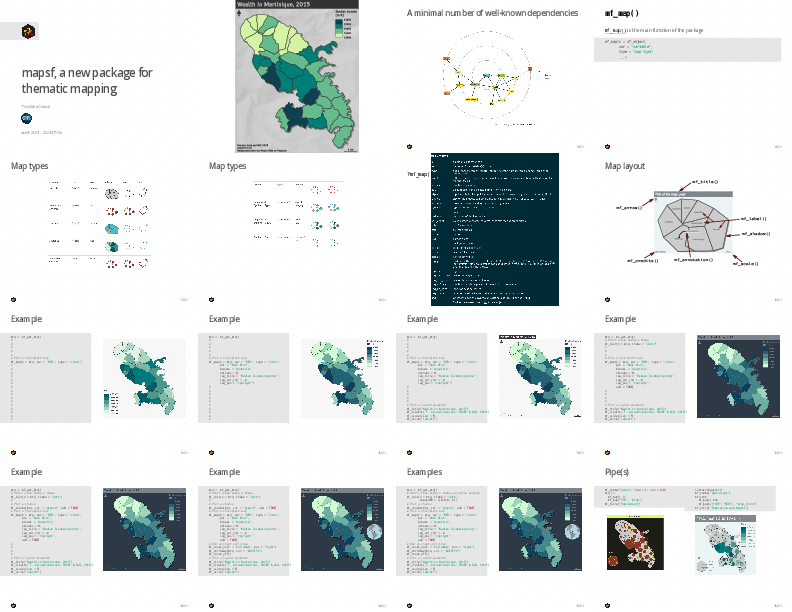

## [`mapsf`, a New Package for Thematic Mapping](https://rcarto.github.io/user2021/) 

**Timothée Giraud** - CNRS    
**[useR! 2021](https://user2021.r-project.org/) - 2021/07/06**  

## [Slides](https://rcarto.github.io/user2021/)

## [Video](https://youtu.be/8PMF7cBBH7k?t=2621)

## Abstract
[`mapsf`](https://riatelab.github.io/mapsf/) helps to design various cartographic representations such as proportional symbols, choropleth or typology maps. It also offers several functions to display layout elements that improve the graphic presentation of maps.

The aim of [`mapsf`](https://riatelab.github.io/mapsf/) is to obtain thematic maps with the visual quality of those built with a classical mapping or GIS software while being lightweight, versatile and user-friendly. To achieve this goal, the package takes advantage of the features offered by [`sf`](https://github.com/r-spatial/sf) and provides a limited number of simple mapping functions.

[`mapsf`](https://riatelab.github.io/mapsf/) is the successor of [`cartography`](https://github.com/riatelab/cartography), it offers the same core features but it is simpler and more robust. Unlike other popular cartographic packages, it does not use grammar of graphics, it depends on a limited number of packages and displays georeferenced plots using base R graphics.

The main function of the package, [`mf_map()`](https://riatelab.github.io/mapsf/reference/mf_map.html), gives access to [9 map types](https://riatelab.github.io/mapsf/articles/mapsf.html#symbology): base maps, proportional or graduated symbols, choropleth maps, typology maps and various combinations of symbology. Many parameters are available to fine tune the cartographic representations. These parameters are the common ones found in GIS and automatic cartography tools (e.g. classification, color palettes, symbols sizes, legend layout...).

Some additional functions are dedicated to layout design ([graphic themes](https://riatelab.github.io/mapsf/articles/web_only/how_to_use_themes.html), [legends](https://riatelab.github.io/mapsf/reference/mf_legend.html), [scale bar](https://riatelab.github.io/mapsf/reference/mf_scale.html), [north arrow](https://riatelab.github.io/mapsf/reference/mf_arrow.html), [title](https://riatelab.github.io/mapsf/reference/mf_title.html), [credits](https://riatelab.github.io/mapsf/reference/mf_credits.html)…), [map insets](https://riatelab.github.io/mapsf/articles/web_only/how_to_create_inset_maps.html) or [map exports](https://riatelab.github.io/mapsf/articles/web_only/how_to_export_maps.html).

The development of [`mapsf`](https://riatelab.github.io/mapsf/) follows the current best practices of the R ecosystem ([CI/CD](https://github.com/riatelab/mapsf/actions), [coverage, tests](https://app.codecov.io/gh/riatelab/mapsf)) and its documentation is enhanced by a [vignette](https://riatelab.github.io/mapsf/articles/mapsf.html) and a [website](https://riatelab.github.io/mapsf/).
