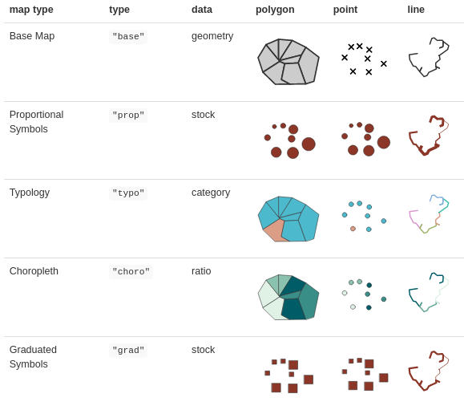
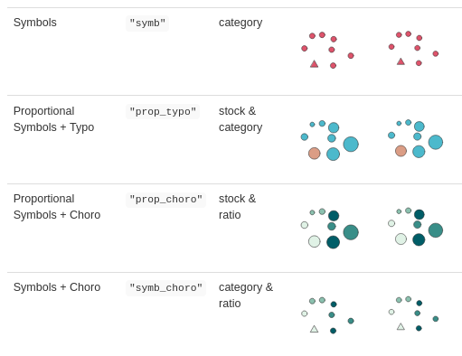

```{r setup, include=FALSE}
knitr::opts_chunk$set(echo = TRUE, cache=TRUE)
```

## {data-background=img/map2.svg data-background-size=contain}

## {data-background=img/map.svg data-background-size=contain}

```{r, echo = FALSE, message = FALSE, results='hide'}
library(mapsf)
mtq <- mf_get_mtq()
th <- mf_theme("default", fg = "grey20", bg = "grey80", mar = c(0,0,2,0), 
               line = 2, tab = FALSE, cex = 1.5)
mf_export(mtq, export = "svg", height = 7, res = 80,
          filename = "img/map2.svg", theme = th, family = "B612")
mf_background("img/marjan-blan-marjanblan-_kUxT8WkoeY-unsplash.jpg")
mf_shadow(mtq, add = TRUE)
mf_map(mtq, "MED", "choro",
       leg_title = "Median Income\n(in €)", 
       breaks = "equal",
       pal = "Emrld",
       nbreaks = 4,
       leg_pos = "topright", leg_val_rnd = -2, add = TRUE)
mf_title("Wealth in Martinique, 2015")
mf_credits(
  txt = paste0("Sources: Insee and IGN, 2018\n",
               "mapsf ",
               packageVersion("mapsf"),"\n",
               'Background photo by Marjan Blan on Unsplash'))
mf_arrow()
mf_scale(5)
dev.off()
```


## A minimal number of well-known dependencies

```{r, echo = FALSE, eval = FALSE, results='hide'}
library(deepdep)
dep <- deepdep("mapsf", depth = 8)
png("img/deps.png", width  = 700, height = 550)
plot_dependencies(dep, "circular", same_level = TRUE, reverse = TRUE)
dev.off()

```
<center>

</center>

## `mf_map()`

[`mf_map()`](https://riatelab.github.io/mapsf/reference/mf_map.html) is the main function of the package.

```r 
mf_map(x = sf_object, 
       var = "variable", 
       type = "map type", 
       ...)
```

## `mf_map()` {data-background=img/help.png data-background-size=contain}


## Map types

<center>

</center>


## Map types
<center>

</center>


## Map layout
<div class="columns-2"> 

  

 
```r
mf_title()
mf_arrow()
mf_credits()
mf_scale() 	
mf_layout() 
mf_annotation() 	
mf_label()
mf_shadow()
```

</div>


## Examples {.smaller}

<div class="columns-2">
```{r, results='hide', message = FALSE, echo = FALSE}
library(mapsf)
```

```{r, message = FALSE, results='hide', fig.width = 5, fig.height=5}
mtq <- mf_get_mtq()
# Start a map using a theme and extra margins 
mf_init(x = mtq, theme = "dark",
        expandBB = c(0,0,0,.3)) 
# Plot a shadow
mf_shadow(mtq, col = "grey10", add = TRUE)
# Plot a choropleth map
mf_map(x = mtq, var = "MED", type = "choro",
       pal = "Dark Mint", 
       breaks = "quantile", 
       nbreaks = 6, 
       leg_title = "Median Income\n(euros)", 
       leg_val_rnd = -2,
       add = TRUE)
# Add an inset world map
mf_inset_on(x = "worldmap", pos = "right")
mf_worldmap(mtq, col = "#0E3F5C")
mf_inset_off()
# Plot a layout elements
mf_title("Wealth in Martinique, 2015")
mf_credits("T. Giraud\nSources: INSEE & IGN, 2018")
mf_scale(size = 5)
mf_arrow('topleft')


```

</div>


## https://riatelab.github.io/mapsf/

<center>
[](https://riatelab.github.io/mapsf/)
</center>


## Vignettes
<center>
### [Introduction and examples](https://riatelab.github.io/mapsf/articles/mapsf.html#examples-of-thematic-maps-1)  
### [How to Export Maps](https://riatelab.github.io/mapsf/articles/web_only/how_to_export_maps.html)  
### [How to Create Inset Maps](https://riatelab.github.io/mapsf/articles/web_only/how_to_create_inset_maps.html)  
### [How to Use Themes](https://riatelab.github.io/mapsf/articles/web_only/how_to_use_themes.html)  
</center>

<!-- ## Alternative Solutions -->

<!-- ### `ggplot2` (Wickham, 2016) <small>+ [`ggspatial`](https://github.com/paleolimbot/ggspatial) (Dunnington, 2018)</small>   -->
<!-- * A general purpose graphic library -->

<!-- ### [`tmap`](https://github.com/mtennekes/tmap) (Tennekes, 2018)   -->
<!-- * A mapping library with similar functionalities -->
<!-- * Uses a different grammar (*à la* `ggplot2`) -->
<!-- * Allows interactive maps -->

<!-- ### [`cartography`](https://github.com/riatelab/cartography) (Giraud and Lambert, 2016)   -->
<!-- * `mapsf` predecessor -->
<!-- * In maintenance mode -->


## Thank You

  [riatelab.github.io/mapsf](riatelab.github.io/mapsf)  
</br>
  [github.com/rCarto/user2021](https://github.com/rCarto/user2021)  
</br>
  [github.com/riatelab/mapsf](https://github.com/riatelab/mapsf)  
</br>
  [\@rgeomatic](http://twitter.com/rgeomatic)  
</br>
  [rgeomatic.hypotheses.org](https://rgeomatic.hypotheses.org/)


</div>
